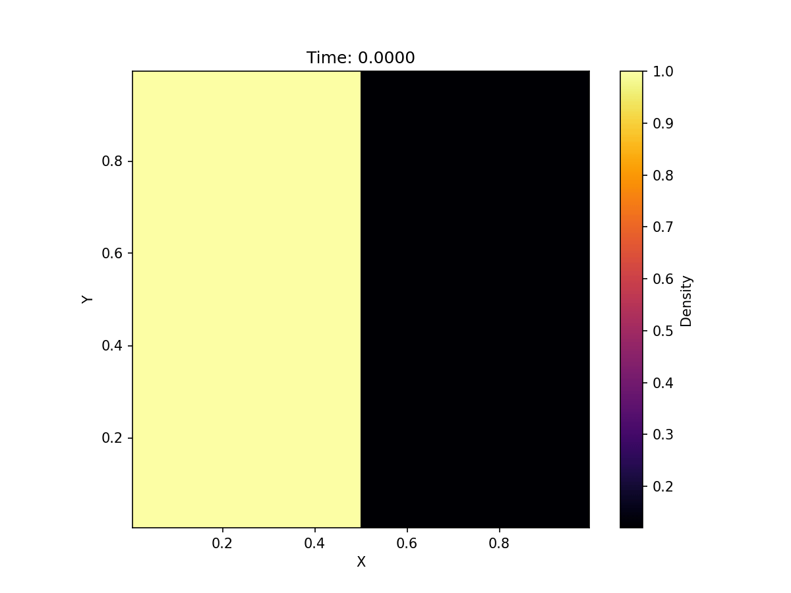
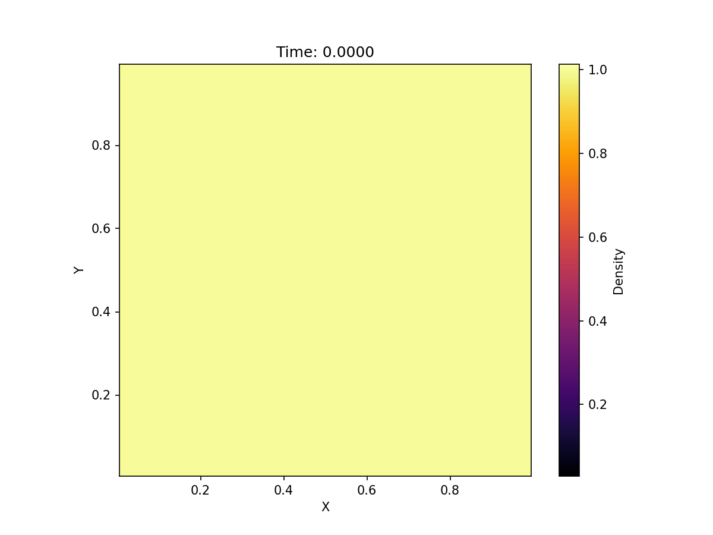
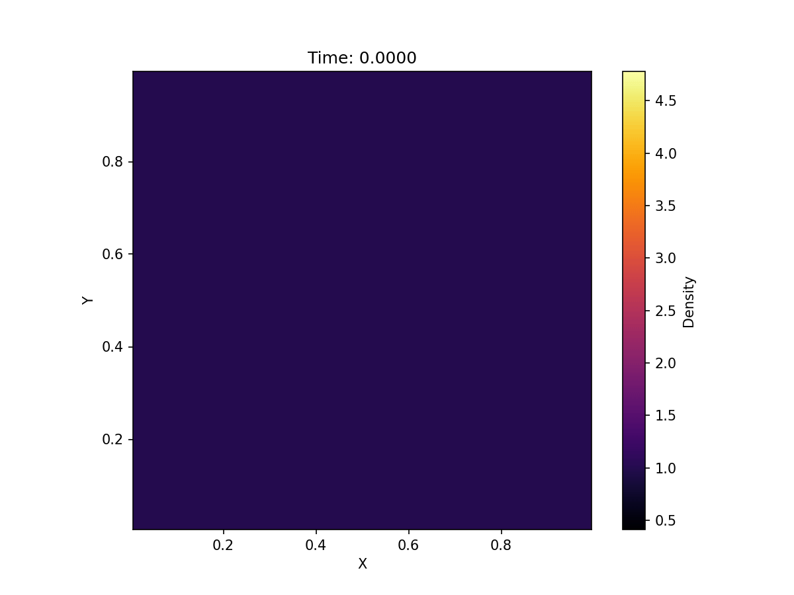
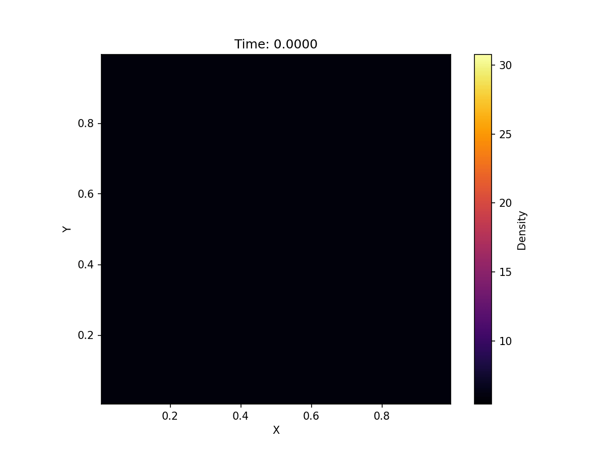

# Extreme-Conditions
Some initial visualisations from 2D extension of simple compressible euler equations can be seen below. These visualisations were created using `visualise.py`, a script located in the `visualisation` folder. This script was written in whole by Gemini-3-Pro as a placeholder. In the future, I plan to use VisIt/ParaView to visualise large-scale simulations. All other code was written by me with minimal, if any, use of AI. The 1-dimensional base of this code can be found in my other repo [Compressible-Fluids](https://github.com/abhirao-03/Compressible-Fluids). Special thanks to [Joseph Azrak](https://josephazrak.com/) for core bug fixes and performance enhancement suggestions.

## Circular Explosion Initial Condition
The visualisation below showcases the 2D extension of the 1D compressible fluid solver working appropriately.

All tests below this one aim to test the 2D extensions against the 1D counterpart to observe mismatch in physics behaviour.

## Toro First Initial Condition

## Toro Second Initial Condition

## Toro Third Initial Conditions

## Toro Fourth Initial Condition

## Toro Fifth Initial Condition
Note that while this may seem like non-conservative behaviour, this test is expected to showcase what we see below. It may seem that density arises out of nowhere but that is caused by the colour-map not showcasing the exact initial condition appropriately. In reality both regions have density, this can be verified by going to `initials.cpp` and examining the definition of `Simulation::ToroInitialFive`.

